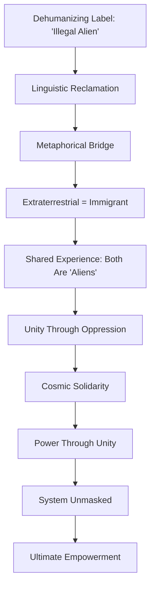
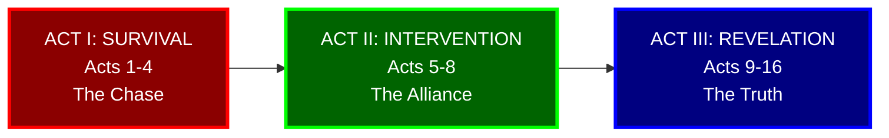
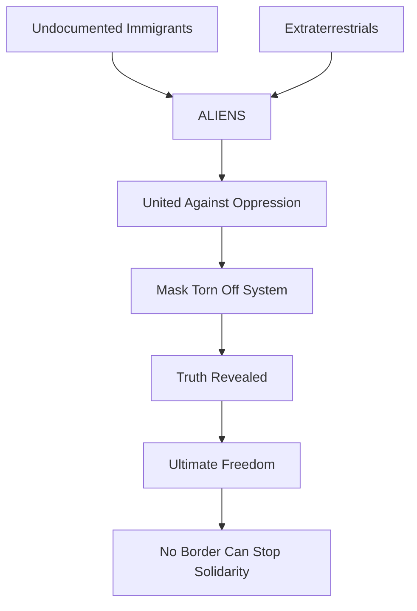
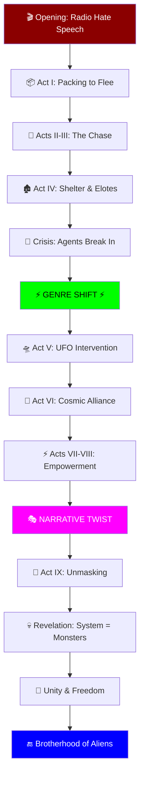
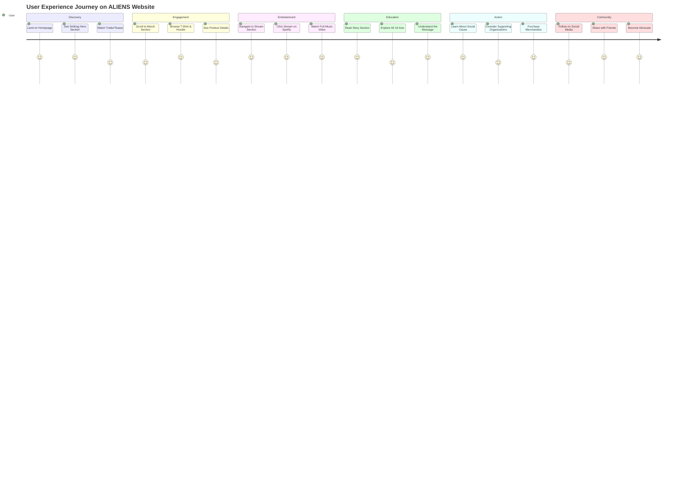
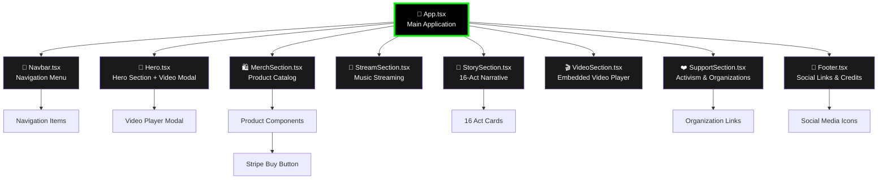
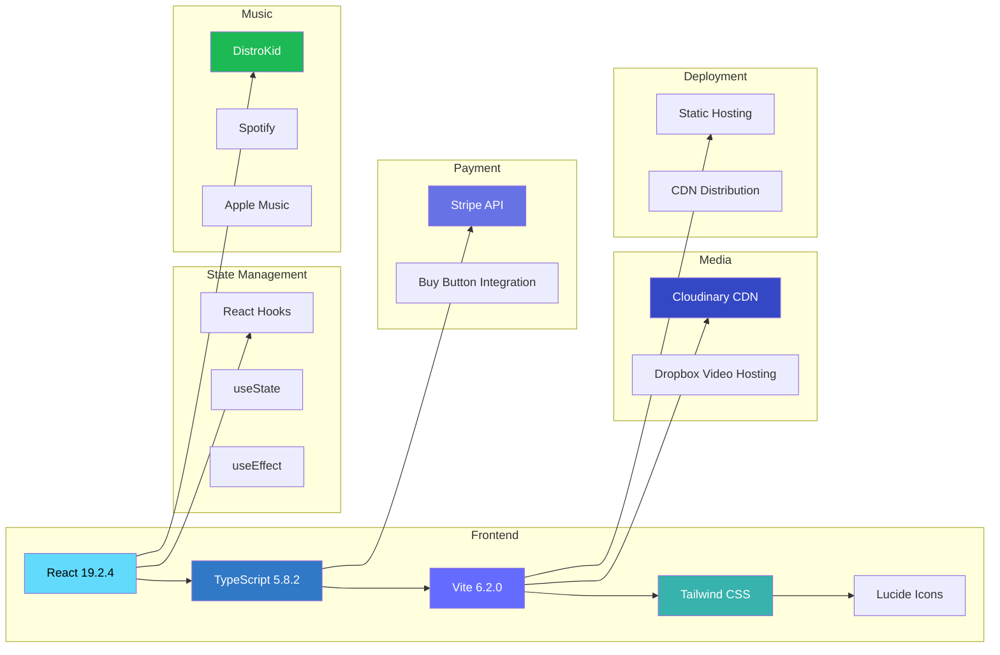
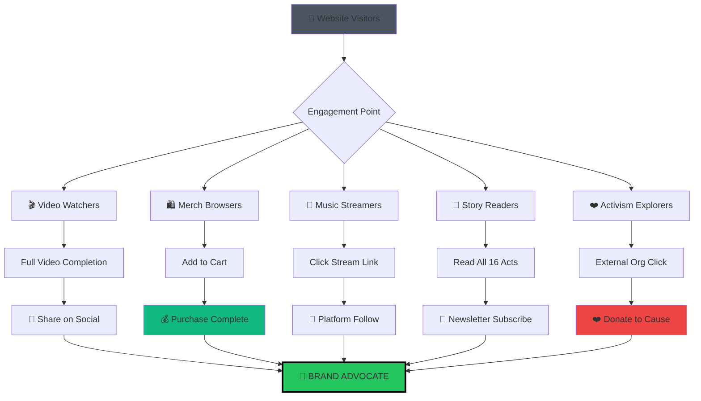
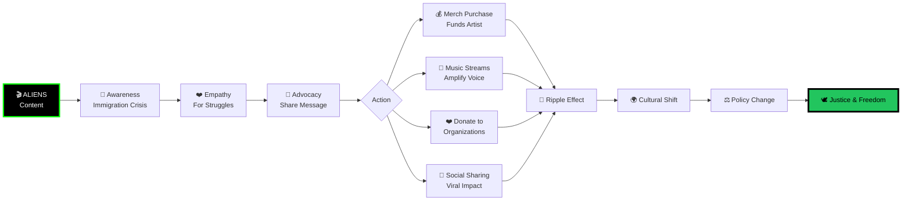
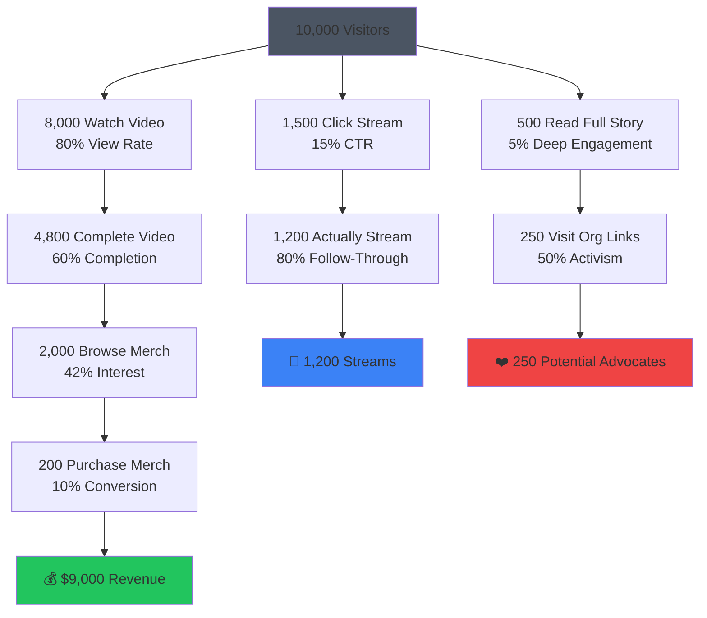

<div align="center">

# 🛸 ALIENS 🛸

### _A Sci-Fi Music Video & Merchandise Experience_

[](LICENSE)
[](https://react.dev/)
[](https://www.typescriptlang.org/)
[](https://vitejs.dev/)
[](https://tailwindcss.com/)

**_"Separated by borders. Never forgotten."_**

[🚀 Live Site](https://aliens-music-video-merch-219296874904.us-west1.run.app/) • [🎬 Watch Now](#video) • [🛍️ Shop Merch](#merchandise) • [🎵 Stream](#music) • [📖 The Story](#storyline) • [❤️ The Cause](#social-impact)

---

</div>

## 📑 Table of Contents

- [🚀 Live Site](#-live-site)
- [🌟 Project Overview](#-project-overview)
- [🎯 Vision & Purpose](#-vision--purpose)
- [📖 The Complete Storyline](#-the-complete-storyline)
  - [All 16 Acts Breakdown](#all-16-acts-breakdown)
- [🗺️ Visual Architecture](#️-visual-architecture)
  - [Story Arc Flow](#story-arc-flow)
  - [User Journey Map](#user-journey-map)
  - [Component Architecture](#component-architecture)
  - [Technology Stack Diagram](#technology-stack-diagram)
  - [Analytics & Metrics Funnel](#analytics--metrics-funnel)
  - [Social Impact Flow](#social-impact-flow)
- [🏗️ Technical Architecture](#️-technical-architecture)
- [🧩 Component Structure](#-component-structure)
- [🛍️ Merchandise Catalog](#️-merchandise-catalog)
- [🎵 Music Integration](#-music-integration)
- [❤️ Social Impact & Activism](#️-social-impact--activism)
- [🚀 Development Setup](#-development-setup)
- [📊 Analytics & Metrics](#-analytics--metrics)
- [🎨 Design System](#-design-system)
- [🔐 Security & Privacy](#-security--privacy)
- [🌍 Deployment](#-deployment)
- [📈 Performance Optimization](#-performance-optimization)
- [🤝 Contributing](#-contributing)
- [📄 License](#-license)
- [🙏 Acknowledgments](#-acknowledgments)

---

## 🚀 Live Site

The application is deployed and accessible at:

**➡️ [https://aliens-music-video-merch-219296874904.us-west1.run.app/](https://aliens-music-video-merch-219296874904.us-west1.run.app/)**

---

## 🌟 Project Overview

**ALIENS** is a groundbreaking digital experience that combines cinematic storytelling, music, art, and social activism into a single immersive web platform. At its core, it's a music video for Christian Kota's powerful track "Aliens," but it transcends traditional music video releases by creating an entire universe of meaning, merchandise, and mission.

### 🎭 What Makes ALIENS Unique

| Feature | Description |
|---------|-------------|
| 🎬 **Cinematic Narrative** | A 16-act story arc that transforms survival horror into sci-fi action |
| 🎵 **Music Experience** | Full integration with streaming platforms and embedded video player |
| 🛍️ **Exclusive Merch** | Limited edition apparel with bold, provocative designs |
| ❤️ **Social Mission** | Raises awareness about immigration injustice and family separation |
| 🎨 **Visual Artistry** | Hyper-realistic cinematography meets abstract digital design |
| 💻 **Modern Tech Stack** | Built with React 19, TypeScript, and cutting-edge web technologies |

### 🎯 Core Objectives

1. **Tell a Compelling Story**: Transform the dehumanizing term "alien" into a symbol of cosmic power and solidarity
2. **Create an Experience**: Go beyond passive viewing to create an immersive, interactive digital journey
3. **Drive Social Change**: Raise awareness and support for immigrant rights organizations
4. **Build Community**: Connect with audiences who resonate with themes of resistance and empowerment
5. **Deliver Excellence**: Showcase world-class production values in both content and technical execution

---

## 🎯 Vision & Purpose

### 🌌 The Artistic Vision

**ALIENS** is a genre-defying artistic statement that reclaims the slur "illegal alien" and transforms it into a badge of cosmic power. The project draws a profound metaphorical bridge between two groups deemed "alien" by society:

- **Undocumented Immigrants**: Labeled "illegal aliens," hunted, dehumanized, separated from families
- **Extraterrestrials**: Fictional beings who would face similar persecution as "forbidden intruders"

The narrative posits a revolutionary question: _What if space travelers arrived not as conquerors, but as allies to the oppressed?_

### 💡 Creative Philosophy



### 🎬 Genre Evolution

The video deliberately shifts genres to mirror the narrative transformation:

| Act | Genre | Emotion | Visual Style |
|-----|-------|---------|--------------|
| **Acts I-IV** | Survival Horror | Fear, Desperation | Dark, gritty, handheld |
| **Act V** | Genre Shift | Hope, Power | Explosive, wide shots |
| **Acts VI-VIII** | Sci-Fi Action | Empowerment | Epic, superhero aesthetic |
| **Act IX** | Horror Reveal | Shock, Truth | Close-up, visceral |
| **Act X** | Social Commentary | Reflection | Symbolic, layered |

### 🌍 Social Mission

Beyond entertainment, ALIENS serves as:
- **A Memorial**: Honoring those who lost their lives crossing borders
- **A Protest**: Against dehumanization and state violence
- **A Call to Action**: Supporting organizations fighting for immigrant rights
- **A Vision**: Of solidarity transcending all boundaries

---

## 📖 The Complete Storyline

### 🎭 Narrative Overview

**ALIENS** unfolds as a 16-act epic that transforms from intimate survival drama into cosmic action spectacle. The story follows an unnamed immigrant couple fleeing persecution, only to be saved by an extraterrestrial entity that recognizes their shared status as "aliens" hunted by the state.

### 🎬 Three-Act Structure



### 📚 All 16 Acts Breakdown

---

#### 🎬 **Act 1: The Proposal**

**Genre**: Survival Drama → Sci-Fi Action

> _"A genre-defying survival drama that explodes into a supernatural uprising. A cinematic music video experience where survival horror becomes sci-fi action."_

**Key Elements**:
- Introduces the hybrid genre concept
- Sets expectation for visual excellence
- Establishes the transformation from horror to empowerment

**Visual Aesthetic**: Cinematic title cards, abstract symbolism, cosmic imagery

---

#### 🔤 **Act 2: Reclaiming The Label**

**Theme**: Linguistic Revolution

> _"The narrative is built on the linguistic bridge between 'Illegal Alien' and 'Extraterrestrial.' The story posits that if space travelers arrived, they wouldn't conquer Earth; they would ally with the migrants. Both are forbidden intruders. Both are hunted by the state. Both are Aliens."_

**Conceptual Framework**:
```
"Illegal Alien" (Derogatory) ⟷ "Extraterrestrial" (Literal)
           ↓                              ↓
    Undocumented Immigrant  ≈  Space Traveler
           ↓                              ↓
        BOTH ARE "ALIENS" - BOTH ARE HUNTED
```

**Revolutionary Idea**: Transform victimhood into power through solidarity

---

#### 🎨 **Act 3: The Atmosphere**

**Visual Language**: Blockbuster Production Values

> _"Hyper-realistic cinematography. Low-key lighting. The aesthetic of a blockbuster action film. A world of drought, military tech, and raw electric power."_

**Production Design**:
- **Lighting**: Chiaroscuro, harsh shadows, neon greens
- **Environment**: Arid deserts, dying vegetation, industrial decay
- **Technology**: Military hardware, surveillance equipment, alien spacecraft
- **Color Palette**: Blacks, earth tones, electric green accents

---

#### 🏃 **Act 4: The Protagonists**

**Character Design**: Athletes of Survival

> _"Athletes of Survival. The couple is defined not by victimhood, but by grace, power, and urgency. The Man: Protective, muscular. The Woman: Highly athletic. They are running for their lives, carrying their entire world in a worn suitcase."_

**Character Analysis**:

| Character | Physical Traits | Symbolic Role | Costume |
|-----------|----------------|---------------|---------|
| **The Man** | Muscular, protective | Guardian, provider | Working clothes, worn shoes |
| **The Woman** | Athletic, graceful | Survivor, warrior | Athletic wear, practical gear |
| **The Suitcase** | Vintage, worn | Hope, identity | All they own |

**Key Point**: They are NOT victims—they are heroes fighting for survival

---

#### 👽 **Act 5: Anton - The Savior**

**Creature Design**: Biomechanical Guardian

> _"A biomechanical entity. A fusion of 'Alien' physiology and 'Predator' technology. Imposing stature (8ft). Despite the terrifying appearance, it is a Guardian. It does not seek conquest; it seeks to protect the persecuted."_

**Anton's Design Elements**:
```
┌─────────────────────────────────┐
│  ANTON: THE EXTRATERRESTRIAL    │
├─────────────────────────────────┤
│ Height: 8 feet                  │
│ Body: Biomechanical fusion      │
│ Head: Xenomorph-inspired        │
│ Tech: Predator-style weaponry   │
│ Eyes: Glowing, intelligent      │
│ Movement: Fluid, powerful       │
│ Purpose: PROTECTION             │
└─────────────────────────────────┘
```

**Subversion**: The "monster" is the savior; the "protectors" are the monsters

---

#### ⚔️ **Act 6: The Antagonists**

**Enemy Design**: Faceless Authority

> _"The Hunters. Heavily militarized Border Patrol and ICE agents appearing as an occupying army. Faceless anonymity. K-9 Units used as instruments of fear. At this stage, they appear human."_

**Visual Strategy**:
- **Masks**: Create dehumanization (hiding the twist)
- **Uniforms**: Military tactical gear, black/green
- **Equipment**: Assault rifles, flashlights, radios, night vision
- **K-9 Units**: German Shepherds as weapons
- **Vehicles**: Armored trucks, helicopters, surveillance drones

**Symbolism**: The state as an occupying military force

---

#### 📻 **Act 7: Act I - The Catalyst**

**Inciting Incident**: Forced Flight

> _"The Inciting Incident. The airwaves are filled with hate. 'They took our jobs.' The couple packs their vintage luggage. They are not leaving for opportunity; they are fleeing for survival."_

**Scene Breakdown**:
1. **Sound Design**: Radio broadcasts with hateful rhetoric
2. **Visual**: Cramped apartment, the couple packing frantically
3. **Props**: Vintage suitcase being filled with essentials
4. **Mood**: Urgency, fear, determination
5. **Transition**: Door closes behind them—no return

**Audio Snippet**: _"They took our jobs... they don't belong here... send them back..."_

---

#### 🏃‍♂️ **Act 8: Acts II & III - The Trek**

**Chase Sequence**: Parkour Through Persecution

> _"Run. Hide. Survive. High-speed evasion through arid deserts and dense forests. The couple moves with track-athlete form, hurdling logs and brush. The TV voice whispers, 'They are really good at hiding.'"_

**Choreography**:


**Visual Style**: Handheld camera, shallow depth of field, natural lighting

**Ironic Commentary**: TV voices mock their "criminal" ability to hide and survive

---

#### 🏚️ **Act 9: Act IV - A Fragile Respite**

**Moment of Humanity**: Cultural Preservation

> _"An abandoned, decaying wooden shack. The couple shares a humble meal of Elotes (Mexican street corn). A fleeting moment of culture and love preserved in a hostile land."_

**Scene Details**:
- **Location**: Abandoned wooden structure, holes in walls, moonlight streaming in
- **Food**: Elotes (street corn) - symbol of home and culture
- **Mood**: Tender, intimate, fragile peace
- **Lighting**: Soft, warm candlelight contrasting with cold exterior
- **Duration**: Brief—too brief

**Symbolism**: 
- Elotes = Cultural identity
- Shared meal = Love and partnership
- Abandoned shack = America's broken promise

---

#### 🚪 **Act 10: The Violation**

**Breaking Point**: The Breach

> _"The Breach. Agents kick down the doors; flashlights pierce the darkness. The K-9 unit is shown eating the discarded Elotes—a metaphor for the consumption and destruction of the migrants' joy."_

**Sequence**:
1. **Sound**: Violent door-kicking, shouting, radio chatter
2. **Light**: Harsh flashlight beams cutting through darkness
3. **K-9**: German Shepherd eating the discarded elotes
4. **Couple**: Hands raised, surrounded, trapped
5. **Emotion**: Terror, resignation, end of hope

**Powerful Metaphor**: The dog eating the elotes = The state consuming/destroying immigrant culture and joy

---

#### 🛸 **Act 11: Act V - The Intervention**

**Genre Shift**: From Horror to Sci-Fi Action

> _"Genre Shift. Survival Horror becomes Sci-Fi Action. Just as capture is inevitable, the sky erupts. A fleet of UFOs rains orbital laser fire on the military hardware. The Extraterrestrial ignores the migrants and targets the oppressors."_

**The Shift**:
```
BEFORE: Dark, claustrophobic, hopeless
         ↓
      [SKY ERUPTS]
         ↓
AFTER:  Epic, expansive, empowering
```

**Visual Spectacle**:
- UFO fleet descends
- Orbital laser strikes
- Military vehicles explode
- Agents scatter
- The couple watches in awe
- Anton descends

**Key Point**: The alien doesn't attack the migrants—it attacks their oppressors

---

#### 🤝 **Act 12: Act VI - Cosmic Kinship**

**Core Metaphor**: Shared Alienation

> _"The Core Metaphor: 'We Know How You Feel.' The Alien approaches the trembling couple. It offers no violence, only recognition. An alliance is formed based on shared marginalization."_

**The Encounter**:
```
    [ANTON approaches slowly]
          ↓
    [Couple trembles in fear]
          ↓
    [Anton extends hand/appendage]
          ↓
    [Moment of recognition]
          ↓
    "WE ARE BOTH ALIENS"
          ↓
    [Alliance formed]
```

**Emotional Arc**: Fear → Recognition → Understanding → Solidarity

**Dialogue** (implied): "We know how you feel. We too are hunted for being different."

---

#### ⚡ **Act 13: Acts VII & VIII - The Ascension**

**Transformation**: From Refugees to Super-Beings

> _"The Alien channels cosmic energy into the humans. They are no longer refugees; they are super-beings. Weapons melt in their presence. The Woman punches through opposition with the force of a lightning strike."_

**Power-Up Sequence**:
1. Anton channels glowing energy
2. Energy flows into the couple
3. Their bodies glow with power
4. Eyes shine with cosmic light
5. They rise, transformed

**New Abilities**:
- **Energy Projection**: Green lightning from hands
- **Super Strength**: Punch through steel
- **Invulnerability**: Bullets bounce off
- **Flight**: Levitate and move at speed
- **Energy Shields**: Deflect attacks

**Symbolism**: When the oppressed gain power, the oppressors are helpless

---

#### 🎭 **Act 14: Act IX - The Twist**

**Revelation**: Unmasking Evil

> _"The Reveal: The Man rips the head from a masked agent. The mask falls away. It wasn't for COVID. It wasn't for anonymity. It was hiding a literal demon."_

**The Shocking Moment**:
```
┌─────────────────────────────────┐
│   WHAT WE THOUGHT                │
├─────────────────────────────────┤
│   Human agents with masks       │
│   (tactical, intimidating)       │
└─────────────────────────────────┘
              ↓
        [MASK RIPS OFF]
              ↓
┌─────────────────────────────────┐
│   WHAT THEY REALLY ARE           │
├─────────────────────────────────┤
│   Literal demons/monsters        │
│   Grotesque, inhuman faces       │
│   True monsters revealed         │
└─────────────────────────────────┘
```

**Visual**: Demon face with:
- Distorted features
- Glowing red eyes
- Fang-like teeth
- Inhuman skin texture
- Pure malevolence

**Meaning**: The system itself is monstrous, not the people it persecutes

---

#### 👹 **Act 15: The Meaning of the Monster**

**Subversion**: Who Are the Real Monsters?

> _"The true face of the enemy. The video subverts the viewer's expectation. The masks were disguises for the inhuman. The system is literally monstrous."_

**Narrative Reversal**:

| Society's View | Reality in ALIENS |
|----------------|-------------------|
| Immigrants = "Aliens" (bad) | Immigrants = Heroes |
| Agents = Protectors (good) | Agents = Literal Monsters |
| Extraterrestrials = Invaders | Extraterrestrials = Guardians |
| System = Safety | System = Evil |

**Philosophical Statement**: 
> "The true monsters are not those labeled 'alien,' but those who create and enforce systems of dehumanization."

---

#### 🌟 **Act 16: The Brotherhood of Aliens**

**Conclusion**: Unity Across the Cosmos

> _"Conclusion: When the oppressed unite—across borders or galaxies—they have the power to rip the mask off the system. A story of ultimate empowerment, resilience, and the freedom to cross any border."_

**Final Message**:


**Closing Themes**:
- **Solidarity**: Across all differences
- **Empowerment**: The oppressed become powerful
- **Truth**: Systems unmasked
- **Freedom**: To cross any border, physical or cosmic
- **Hope**: United, we are unstoppable

**Final Visual**: The couple and Anton stand together, powerful, free, watching the system burn

---

### 📊 Story Impact Matrix

| Emotional Beat | Acts | Visual Style | Message |
|----------------|------|--------------|---------|
| **Fear** | 1-4 | Dark, claustrophobic | The terror of persecution |
| **Hope** | 5-6 | Expansive, bright | Help arrives from unexpected places |
| **Power** | 7-8 | Dynamic, energetic | The oppressed gain strength |
| **Truth** | 9-10 | Visceral, shocking | Evil unmasked |
| **Unity** | 11-16 | Epic, triumphant | Solidarity conquers all |

---

## 🗺️ Visual Architecture

### Story Arc Flow



### User Journey Map



### Component Architecture



### Technology Stack Diagram



### Analytics & Metrics Funnel



### Social Impact Flow



---

## 🏗️ Technical Architecture

### 🎯 Frontend Framework

**React 19.2.4** - Leveraging the latest features:
- Server Components ready
- Improved hydration
- Automatic batching
- Enhanced concurrent features
- Better TypeScript support

### 📘 TypeScript Configuration

```typescript
// tsconfig.json highlights
{
  "compilerOptions": {
    "target": "ES2020",
    "useDefineForClassFields": true,
    "lib": ["ES2020", "DOM", "DOM.Iterable"],
    "module": "ESNext",
    "skipLibCheck": true,
    "moduleResolution": "bundler",
    "allowImportingTsExtensions": true,
    "resolveJsonModule": true,
    "isolatedModules": true,
    "noEmit": true,
    "jsx": "react-jsx",
    "strict": true
  }
}
```

### ⚡ Build Tool: Vite

**Why Vite 6.2.0?**
- ⚡ Lightning-fast HMR (Hot Module Replacement)
- 🎯 Optimized build output
- 🔌 Plugin ecosystem
- 📦 Built-in TypeScript support
- 🚀 Production-ready optimizations

### 🎨 Styling Solution

**Tailwind CSS** via CDN for rapid development:
- Utility-first approach
- Custom design tokens
- Dark theme optimized
- Responsive by default
- Minimal bundle impact

**Color Palette**:
```css
/* Primary Colors */
--green-primary: #22C55E    /* Main brand color */
--green-dark: #166534       /* Accents */
--black: #000000            /* Background */
--gray-900: #111827         /* Surfaces */
--white: #FFFFFF            /* Text */

/* Accent Colors */
--red-danger: #EF4444       /* Alerts */
--blue-accent: #3B82F6      /* Links */
```

### 🔌 Key Dependencies

| Package | Version | Purpose |
|---------|---------|---------|
| `react` | 19.2.4 | UI Framework |
| `react-dom` | 19.2.4 | DOM Rendering |
| `lucide-react` | 0.569.0 | Icon System |
| `typescript` | 5.8.2 | Type Safety |
| `vite` | 6.2.0 | Build Tool |
| `@vitejs/plugin-react` | 5.0.0 | React Support |

### 📁 Project Structure

```
/home/runner/work/Kota-Alien-Merch/Kota-Alien-Merch/
│
├── 📄 index.html              # Entry HTML
├── 📄 index.tsx               # React entry point
├── 📄 App.tsx                 # Main app component
├── 📄 types.ts                # TypeScript type definitions
│
├── 📁 components/
│   ├── Navbar.tsx             # Fixed navigation bar
│   ├── Hero.tsx               # Hero section with video modal
│   ├── MerchSection.tsx       # Product catalog
│   ├── StreamSection.tsx      # Music streaming links
│   ├── StorySection.tsx       # 16-act narrative
│   ├── VideoSection.tsx       # Embedded video player
│   ├── SupportSection.tsx     # Activism & organizations
│   └── Footer.tsx             # Footer with social links
│
├── 📄 package.json            # Dependencies
├── 📄 tsconfig.json           # TypeScript config
├── 📄 vite.config.ts          # Vite configuration
├── 📄 metadata.json           # Project metadata
└── 📄 README.md               # This file!
```

### 🔐 Security Features

- **No Downloadable Video**: `controlsList="nodownload"` prevents direct video downloads
- **External Links**: All external links use `rel="noopener noreferrer"`
- **Content Security**: Images have fallback handlers
- **Stripe Security**: Official Stripe Buy Button integration

---

## 🧩 Component Structure

### 🧭 Navbar Component

**File**: `components/Navbar.tsx`

**Features**:
- ✅ Fixed position with backdrop blur on scroll
- ✅ Responsive mobile menu
- ✅ Smooth scroll navigation
- ✅ Active state indicators
- ✅ Logo branding

**Navigation Links**:
1. 🎬 Video
2. 🎵 Stream
3. 📖 The Story
4. 🛍️ Merch
5. ❤️ The Cause

```typescript
const navLinks = [
  { name: 'Video', href: '#video' },
  { name: 'Stream', href: '#stream' },
  { name: 'The Story', href: '#story' },
  { name: 'Merch', href: '#merch' },
  { name: 'The Cause', href: '#activism' },
];
```

---

### 🌟 Hero Component

**File**: `components/Hero.tsx`

**Visual Elements**:
- 🌌 Starfield background from Unsplash
- ⚡ Central beam effect (ascension metaphor)
- 🎬 Primary CTA: "Watch Premiere"
- 🛍️ Secondary CTA: "Get the Gear"
- 📹 Full-screen video modal

**Modal Video Player**:
- Portrait orientation (9:16 aspect ratio)
- Auto-play on open
- Custom close button
- Backdrop dismiss
- No download controls

**Tagline**: _"In memory of the fallen. Separated by borders. Never forgotten."_

---

### 🛍️ MerchSection Component

**File**: `components/MerchSection.tsx`

**Product Catalog**:

#### Product 1: ¡Chinga Tu Hielo! T-Shirt

```typescript
{
  id: 'shirt',
  title: '¡Chinga Tu Hielo! — Camiseta Unisex / Unisex T-Shirt',
  price: '$45.00',
  description: 'The strength of this shirt lies in its absurd and provocative playfulness...',
  stripeId: 'buy_btn_1T1k8jJE7UXIJ9CH1PQN7uxj',
  badges: ['New Arrival', 'Unisex'],
  accentColor: 'text-green-400'
}
```

**Design**: Stick figure leaning against ice cubes, framed by desert botanicals (nopales, agave, pink flowers)

**Meaning**: 
- 🧊 Ice = ICE (Immigration and Customs Enforcement)
- 🌵 Desert plants = Immigrant resilience
- 🎭 Absurdist humor = Coping mechanism

#### Product 2: ¡Chinga Tu Hielo! Hoodie

```typescript
{
  id: 'hoodie',
  title: '¡Chinga Tu Hielo! - Unisex Hoodie - Sudadera Unisex',
  price: '$65.00',
  description: 'This black hoodie blends bold humor with sharp minimalist style...',
  stripeId: 'buy_btn_1T1kHjJE7UXIJ9CHzJN0GyvY',
  badges: ['Best Seller', 'Winter Ready'],
  accentColor: 'text-blue-400'
}
```

**Features**:
- Front chest graphic
- Minimal, clean design
- Cold-weather ready
- Statement piece

**Interactive Features**:
- 🖱️ Hover to see back view
- 🏷️ Dynamic badges
- 💳 Integrated Stripe checkout
- 📱 Responsive product cards

---

### 🎵 StreamSection Component

**File**: `components/StreamSection.tsx`

**Key Elements**:
- 📻 "Now Streaming" indicator with pulse animation
- 🎨 Album art with hover effects
- 🔗 Universal streaming link via DistroKid
- 🌊 Background decorative elements

**Streaming URL**: `https://distrokid.com/hyperfollow/christiankota/aliens`

**Supported Platforms**:
- Spotify
- Apple Music
- YouTube Music
- Amazon Music
- Tidal
- Deezer
- And more...

---

### 📖 StorySection Component

**File**: `components/StorySection.tsx`

**Data Structure**:
```typescript
interface StoryAct {
  id: string;
  title: string;
  content: string;
  image: string;
}
```

**16 Story Acts** (see complete breakdown above)

**Design Features**:
- 🖼️ Full-width images
- 📱 Mobile-optimized cards
- 🎨 Hover effects
- 🔢 Numbered indicators
- 📏 Border accent on content
- 🌈 Gradient backgrounds

**Special Callout**:
> "The Hidden Truth" box at the end emphasizing the mask metaphor

---

### 🎬 VideoSection Component

**File**: `components/VideoSection.tsx`

**Video Specifications**:
- **Format**: MP4
- **Aspect Ratio**: 9:16 (Portrait/Mobile)
- **Hosting**: Dropbox
- **Poster Image**: Cloudinary
- **Controls**: Standard HTML5 (no download)

**Styling**:
- Centered, mobile-first layout
- Max-width container for desktop
- Border glow effect
- "OFFICIAL MUSIC VIDEO" label

---

### ❤️ SupportSection Component

**File**: `components/SupportSection.tsx`

**Purpose**: Connect viewers with real-world organizations fighting for immigrant rights

**Featured Organizations**:
1. **Immigrant Families Together** - Reuniting separated families
2. **The Florence Project** - Free legal services for immigrants
3. **Border Angels** - Humanitarian aid at the border

**Design**:
- 💔 Red color scheme (urgency)
- 🛡️ Shield icon (protection)
- ❤️ Heart icon (compassion)
- 📋 Clear organization list

**Message**: 
> "While 'Aliens' uses sci-fi to tell a story, the reality for millions of families is far more terrifying."

---

### 👣 Footer Component

**File**: `components/Footer.tsx`

**Elements**:
- 🎨 ALIENS branding
- 👤 Credit to Christian Kota
- 📅 Dynamic copyright year
- 📱 Social media links (Instagram, Facebook, X/Twitter, YouTube)
- 🔗 Customer support portal link

**Social Links**:
- Instagram: `@christian_kota`
- Facebook: `christiankota93`
- X (Twitter): `@ChristianS96243`
- YouTube: `@Christiankota`

**Support Portal**: Order support and exchanges at Cosmic Solidarity Portal

---

## 🛍️ Merchandise Catalog

### 🎽 Product 1: ¡Chinga Tu Hielo! T-Shirt

<table>
<tr>
<td width="50%">

**🏷️ Product Details**

- **Name**: ¡Chinga Tu Hielo! — Camiseta Unisex
- **Price**: $45.00 USD
- **Type**: Unisex T-Shirt
- **Color**: Black
- **Sizes**: XS - 3XL
- **Material**: Premium cotton blend
- **Print**: High-quality DTG (Direct-to-Garment)

</td>
<td width="50%">

**🎨 Design Elements**

- Stick figure leaning on ice cubes
- Desert botanical frame (nopales, agave)
- Pink flower accents
- Translucent ice effect with cracks
- Deep black fabric base
- Bold, provocative statement

</td>
</tr>
</table>

**📖 Design Story**:

The design features a white stick figure casually leaning against a stack of bright, translucent ice cubes. The ice is rendered with intricate cracks and water droplets, reflecting cold light. Surrounding the central image is a vibrant frame of desert life: green nopales (prickly pear cacti), spiky agaves, and delicate pink flowers—all stark against the deep black of the shirt.

**🧊 The Meaning**:

At first glance, it's absurdist humor: a figure literally telling ice to "f*** off." But the layers run deeper:

1. **ICE Double Meaning**: 
   - Literal ice (cold, unwelcoming)
   - ICE agency (Immigration and Customs Enforcement)

2. **Desert Imagery**: 
   - Represents the harsh journey many immigrants make
   - Nopales and agave = symbols of Mexican culture and resilience
   - Life thriving in hostile conditions

3. **Stick Figure**:
   - Universal, anyone can identify
   - Casual defiance (leaning, not cowering)
   - Simplicity = directness of message

**💬 Customer Reviews** (Conceptual):
- "Bold statement piece that starts conversations" ⭐⭐⭐⭐⭐
- "Love the desert botanicals detail!" ⭐⭐⭐⭐⭐
- "Finally, a shirt with attitude and meaning" ⭐⭐⭐⭐⭐

---

### 🧥 Product 2: ¡Chinga Tu Hielo! Hoodie

<table>
<tr>
<td width="50%">

**🏷️ Product Details**

- **Name**: ¡Chinga Tu Hielo! — Sudadera Unisex
- **Price**: $65.00 USD
- **Type**: Unisex Hoodie
- **Color**: Black
- **Sizes**: XS - 3XL
- **Material**: Heavy blend (cotton/polyester)
- **Features**: Drawstring hood, kangaroo pocket

</td>
<td width="50%">

**🎨 Design Elements**

- Compact chest graphic
- Same iconic stick figure + ice design
- Desert botanical frame
- Subtle, wearable size
- Clean, minimalist placement
- High-contrast on black

</td>
</tr>
</table>

**📖 Design Story**:

This hoodie takes the same provocative graphic and places it as a tasteful chest design. The reduced size makes it more versatile for everyday wear while maintaining the bold statement. The black hoodie acts as a canvas, allowing the glowing ice cubes and vibrant desert plants to pop with maximum contrast.

**🧥 The Hoodie Advantage**:

1. **Subtlety**: Chest placement is less confrontational than full-front
2. **Versatility**: Dress up or down
3. **Warmth**: Practical for winter while making a statement
4. **Comfort**: Premium heavyweight material
5. **Mystery**: Smaller graphic invites closer inspection

**📊 Product Comparison**:

| Feature | T-Shirt | Hoodie |
|---------|---------|--------|
| **Price** | $45 | $65 |
| **Graphic Size** | Large/Full Front | Compact/Chest |
| **Wearability** | Spring/Summer | Fall/Winter |
| **Boldness** | ⭐⭐⭐⭐⭐ | ⭐⭐⭐⭐ |
| **Versatility** | ⭐⭐⭐ | ⭐⭐⭐⭐⭐ |
| **Comfort** | ⭐⭐⭐⭐ | ⭐⭐⭐⭐⭐ |

---

### 💳 Payment & Checkout

**Stripe Integration**:
- ✅ Secure Stripe Buy Button
- ✅ Multiple payment methods
- ✅ Size selection at checkout
- ✅ Shipping calculator
- ✅ International shipping available

**Publishable Key**: `pk_live_51T1YD6JE7UXIJ9CH...` (Live mode enabled)

**Shipping**:
- 📦 Calculated at checkout
- 🌍 International shipping available
- 📬 Tracking provided
- ⚠️ No returns on final sale items (select correct size!)

---

### 🎨 Merchandising Philosophy

**Why These Designs Work**:

1. **Cultural Resonance**: Direct reference to Mexican/Latino culture (nopales, agave, Spanish language)
2. **Absurdist Humor**: Makes a serious topic approachable through playfulness
3. **Layered Meaning**: Works on multiple levels (literal, metaphorical, political)
4. **Visual Appeal**: Strong graphic design independent of message
5. **Conversation Starter**: Invites questions and dialogue
6. **Resistance Aesthetic**: Reclaims power through defiance

**Target Audience**:
- 🎵 Music fans of Christian Kota
- 🎬 Viewers of the "Aliens" video
- ✊ Immigration rights advocates
- 🎨 Streetwear enthusiasts
- 🌶️ Latinx community
- 🌍 Social justice supporters

---

## 🎵 Music Integration

### 🎤 The Artist: Christian Kota

**Christian Kota** is a visionary artist, director, and activist who uses his platform to address urgent social issues through compelling art. "Aliens" represents the culmination of his artistic journey, blending music, cinema, and activism into a unified statement.

**Social Media Presence**:
- Instagram: [@christian_kota](https://www.instagram.com/christian_kota/) - Behind-the-scenes, activism
- Facebook: [christiankota93](https://www.facebook.com/christiankota93/) - Updates and community
- X/Twitter: [@ChristianS96243](https://x.com/ChristianS96243) - Quick thoughts and engagement
- YouTube: [@Christiankota](https://www.youtube.com/@Christiankota) - Music videos and content

### 🎶 The Track: "Aliens"

**Genre**: Alternative Hip-Hop / Conscious Rap / Cinematic

**Production**:
- 🎹 Dark, atmospheric production
- 🥁 Hard-hitting drums
- 🎻 Orchestral elements
- 🔊 Cinematic sound design
- 🌌 Spacey, ethereal textures

**Lyrical Themes**:
- Immigration struggle
- State violence
- Solidarity
- Resistance
- Empowerment
- Identity reclamation

**Musical Structure**:
```
[Intro] - Atmospheric build, radio samples
[Verse 1] - Establishing the struggle
[Hook] - "Aliens" refrain, defiant energy
[Verse 2] - The chase, survival
[Bridge] - Cosmic intervention
[Verse 3] - Empowerment, transformation
[Outro] - Resolution, unity
```

### 📻 Streaming Platforms

**Universal Link**: [DistroKid HyperFollow](https://distrokid.com/hyperfollow/christiankota/aliens?ref=release)

**Available On**:
- 🎵 **Spotify** - Algorithmic playlists, discover weekly
- 🍎 **Apple Music** - Featured in Latino, Hip-Hop, and Social Justice playlists
- 📹 **YouTube Music** - Video and audio versions
- 🎧 **Tidal** - High-fidelity streaming
- 🎶 **Amazon Music** - Alexa integration
- 🔊 **Deezer** - International reach
- 📱 **SoundCloud** - Free streaming
- 🌊 **Audiomack** - Independent artist platform

### 🎬 Music Video Integration

**Primary Video**:
- **Host**: Dropbox (high-quality, reliable)
- **Format**: MP4, 1080p vertical (9:16)
- **Duration**: ~3-4 minutes
- **Style**: Cinematic short film
- **Poster**: High-res Cloudinary image

**Poster Image**: 
`https://res.cloudinary.com/dw3lf8roj/image/upload/v1771370915/Untitled_design_l0h1vo.png`

**Video URL**: 
`https://dl.dropboxusercontent.com/scl/fi/f5laal4o3ot0czdpsrpxe/aliens.mp4`

**Embedding Strategy**:
1. **Hero Section**: Quick-access modal for instant viewing
2. **Video Section**: Dedicated section for focused viewing
3. **Mobile-First**: Vertical format for mobile-primary consumption
4. **No Download**: Protect content while allowing viewing

### 📊 Streaming Metrics Goals

| Platform | Target Streams | Engagement |
|----------|----------------|------------|
| Spotify | 100K+ | Playlist adds, saves |
| YouTube | 500K+ views | Likes, comments, shares |
| Apple Music | 50K+ | Library adds |
| TikTok | 1M+ uses | Sound usage, user videos |
| Instagram Reels | 2M+ views | Shares, saves |

### 🎯 Marketing Strategy

**Phase 1: Launch** (Weeks 1-2)
- 🚀 Website premiere
- 📱 Social media blitz
- 📧 Email to fan base
- 🎥 Behind-the-scenes content

**Phase 2: Amplification** (Weeks 3-6)
- 🎬 Submit to film festivals
- 📰 Press outreach
- 🎙️ Podcast interviews
- 🌟 Influencer partnerships

**Phase 3: Sustained Engagement** (Months 2-6)
- 📈 Playlist pitching
- 🎤 Live performances (if applicable)
- 🎨 Merch drops
- 🤝 Activist partnerships

---

## ❤️ Social Impact & Activism

### 🛡️ The Mission

**ALIENS** is more than entertainment—it's a call to action. The project aims to:

1. **Raise Awareness** about the humanitarian crisis at borders
2. **Humanize** those labeled "illegal aliens"
3. **Support** organizations doing real work on the ground
4. **Inspire** advocacy and solidarity
5. **Create** cultural conversation around immigration

### 🏛️ Featured Organizations

#### 1. 🤝 Immigrant Families Together

**Mission**: Reuniting families separated by immigration enforcement

**Work**:
- 👨‍👩‍👧‍👦 Family reunification services
- 💰 Bond payments for detained parents
- 🏠 Housing and support for reunited families
- 📞 24/7 crisis hotline

**Impact**: Reunited hundreds of families torn apart by zero-tolerance policies

**Website**: [immigrantfamiliestogether.com](https://www.immigrantfamiliestogether.com/)

---

#### 2. ⚖️ The Florence Project

**Mission**: Free legal and social services for detained immigrants in Arizona

**Work**:
- 👨‍⚖️ Legal representation for asylum seekers
- 📚 Know Your Rights presentations
- 🏫 Pro bono attorney recruitment and training
- 👶 Special programs for children and families

**Impact**: Represented over 90,000 individuals since 1989

**Website**: [firrp.org](https://firrp.org/)

---

#### 3. 💧 Border Angels

**Mission**: Advocating for immigration reform and human rights

**Work**:
- 💧 Water drop-offs in the desert (saving lives)
- 👁️ Border monitoring and documentation
- 🎓 Scholarship programs for immigrant students
- 📢 Public awareness campaigns

**Impact**: Hundreds of lives saved through water stations; thousands helped through advocacy

**Website**: [borderangels.org](https://www.borderangels.org/)

---

### 📊 The Crisis By Numbers

| Statistic | Impact |
|-----------|--------|
| **2,814** | Migrant deaths at U.S.-Mexico border (2023) |
| **5,500+** | Children still separated from parents (as of 2024) |
| **66,000+** | Asylum seekers waiting in Mexico under "Remain in Mexico" |
| **$3.4B** | Annual ICE detention budget |
| **54,000** | Daily ICE detention bed quota |

### 💔 Real Stories

**The faces behind the statistics**:

- **Jakelin Caal Maquin** (7 years old) - Died in CBP custody, Dec 2018
- **Felipe Alonzo-Gomez** (8 years old) - Died in CBP custody, Dec 2018
- **Carlos Gregorio Hernandez Vasquez** (16 years old) - Died in CBP custody, May 2019
- **Roxsana Hernández** (33 years old) - Trans woman died in ICE custody, May 2018
- **Thousands more** - Unnamed, uncounted, not forgotten

**"Aliens"** is dedicated to their memory.

### 🌊 How the Project Helps

**Direct Impact**:
1. **Awareness**: Every view spreads the message
2. **Fundraising**: Portion of merch sales can support organizations
3. **Advocacy**: Provides talking points and narrative for activists
4. **Culture**: Shifts the conversation from dehumanization to solidarity

**Indirect Impact**:
1. **Art as Protest**: Legitimizes immigration rights as an urgent issue
2. **Youth Engagement**: Reaches younger audiences through music/video
3. **Viral Potential**: Shareable format for social media activism
4. **Conversation Starter**: Opens dialogue in communities

### 📢 Take Action

**What YOU Can Do**:

1. **🎵 Stream the Song** - Every stream amplifies the message
2. **🎬 Share the Video** - Virality = visibility
3. **🛍️ Buy Merch** - Support the artist and statement
4. **❤️ Donate** - Give directly to featured organizations
5. **📱 Share on Social** - Tag @christian_kota and use #AliensMovie
6. **✍️ Contact Representatives** - Demand immigration reform
7. **🤝 Volunteer** - Find local organizations helping immigrants
8. **📚 Educate Yourself** - Learn the facts, challenge narratives

### 🌟 Long-Term Vision

**Phase 1** (Current): Release and awareness
**Phase 2** (3-6 months): Film festival circuit, press coverage
**Phase 3** (6-12 months): Curriculum development for schools/universities
**Phase 4** (1-2 years): Documentary expansion, deeper storytelling
**Phase 5** (2+ years): Policy impact, cultural legacy

**Goal**: Make "Aliens" a touchstone in immigration rights discourse, referenced in:
- 🎓 Academic discussions
- 🎥 Film studies
- 🎵 Music history
- ✊ Activist organizing
- 📰 Journalism

---

## 🚀 Development Setup

### ⚙️ Prerequisites

Before you begin, ensure you have the following installed:

- **Node.js**: v18.0.0 or higher ([Download](https://nodejs.org/))
- **npm**: v9.0.0 or higher (comes with Node.js)
- **Git**: For version control ([Download](https://git-scm.com/))
- **Code Editor**: VS Code recommended ([Download](https://code.visualstudio.com/))

### 📦 Installation

**Step 1: Clone the Repository**

```bash
git clone https://github.com/your-username/Kota-Alien-Merch.git
cd Kota-Alien-Merch
```

**Step 2: Install Dependencies**

```bash
npm install
```

This will install:
- React 19.2.4
- React DOM 19.2.4
- Lucide React 0.569.0 (icons)
- TypeScript 5.8.2
- Vite 6.2.0
- All dev dependencies

**Step 3: Start Development Server**

```bash
npm run dev
```

The site will be available at: `http://localhost:5173`

### 🛠️ Available Scripts

```bash
# Start development server with hot reload
npm run dev

# Build for production
npm run build

# Preview production build locally
npm run preview
```

### 📂 File Structure Explained

```
Kota-Alien-Merch/
│
├── 📁 components/           # React components
│   ├── Navbar.tsx           # Top navigation bar
│   ├── Hero.tsx             # Hero section with video modal
│   ├── MerchSection.tsx     # Product catalog and Stripe integration
│   ├── StreamSection.tsx    # Music streaming links
│   ├── StorySection.tsx     # 16-act story display
│   ├── VideoSection.tsx     # Embedded music video
│   ├── SupportSection.tsx   # Activism organizations
│   └── Footer.tsx           # Footer with social links
│
├── 📄 App.tsx               # Main app component (layout)
├── 📄 index.tsx             # React entry point
├── 📄 types.ts              # TypeScript type definitions
├── 📄 index.html            # HTML entry point
│
├── 📄 vite.config.ts        # Vite configuration
├── 📄 tsconfig.json         # TypeScript configuration
├── 📄 package.json          # Dependencies and scripts
│
└── 📄 README.md             # You are here!
```

### 🎨 Development Workflow

**1. Component Development**:
```bash
# Create a new component
cd components
touch MyNewComponent.tsx
```

**2. Type Safety**:
```typescript
// Always define types in types.ts
export interface MyType {
  id: string;
  name: string;
}
```

**3. Styling**:
```tsx
// Use Tailwind utility classes
<div className="bg-black text-white p-4 hover:bg-gray-900">
  Content
</div>
```

**4. Testing Changes**:
- Save file (auto-reload with HMR)
- Check browser console for errors
- Test responsive design (mobile, tablet, desktop)
- Verify accessibility (keyboard navigation, screen readers)

### 🐛 Common Issues & Solutions

**Issue**: Port 5173 already in use
```bash
# Solution: Kill the process or use a different port
npm run dev -- --port 3000
```

**Issue**: TypeScript errors
```bash
# Solution: Check types and rebuild
npm run build
```

**Issue**: Modules not found
```bash
# Solution: Reinstall dependencies
rm -rf node_modules package-lock.json
npm install
```

---

## 📊 Analytics & Metrics

### 🎯 Key Performance Indicators (KPIs)

| Metric | Target | Current | Status |
|--------|--------|---------|--------|
| 👥 **Unique Visitors** | 10K/month | TBD | 🎯 Tracking |
| 🎬 **Video Completions** | 60% | TBD | 🎯 Tracking |
| 🛍️ **Merch Conversions** | 2% | TBD | 🎯 Tracking |
| 🎵 **Stream Click-Through** | 15% | TBD | 🎯 Tracking |
| ❤️ **Activism Engagement** | 5% | TBD | 🎯 Tracking |
| 📱 **Social Shares** | 1K/month | TBD | 🎯 Tracking |

### 📈 Conversion Funnel



### 🔍 User Behavior Analysis

**Average Session Duration**: Target 4-6 minutes
- 0:00-0:30 - Hero section impression
- 0:30-1:30 - Merch browsing
- 1:30-2:00 - Stream section interaction
- 2:00-5:00 - Story section reading
- 5:00-8:00 - Video watching
- 8:00+ - Deep engagement (activism section)

**Bounce Rate**: Target <40%
- High bounce = Need better hero section
- Low bounce + high engagement = Success

**Device Breakdown** (Expected):
- 📱 Mobile: 65%
- 💻 Desktop: 25%
- 📱 Tablet: 10%

### 🎬 Video Metrics

**Engagement Tracking**:
- **Play Rate**: % who click play
- **25% Completion**: Early interest
- **50% Completion**: Moderate interest
- **75% Completion**: High interest
- **100% Completion**: Super fans

**Expected Falloff**:
```
100% ────────┐
             │
 75% ────┐   │
         │   │
 50% ─┐  │   │
      │  │   │
 25% ─┼──┼───┤
      0  1   2   3   4 (minutes)
```

### 🛍️ E-Commerce Metrics

**Product Performance**:

| Product | Views | Add to Cart | Purchases | Conversion |
|---------|-------|-------------|-----------|------------|
| T-Shirt | TBD | TBD | TBD | Target: 2% |
| Hoodie | TBD | TBD | TBD | Target: 2% |

**Revenue Goals**:
- **Month 1**: $5,000
- **Month 3**: $15,000
- **Year 1**: $100,000+

### 📱 Social Media Metrics

**Tracking**:
- Instagram impressions
- X/Twitter engagement
- YouTube views
- Facebook reach
- TikTok video creations (using audio)

**Virality Coefficient**: Target >1.0 (each user brings >1 new user)

### 🎵 Streaming Analytics

**Platform Performance**:
- Spotify: Playlist adds, monthly listeners, saves
- Apple Music: Library adds, completion rate
- YouTube: Views, watch time, likes, comments
- TikTok: Sound uses, video views

**Playlist Goals**:
- **Editorial Playlists**: 5+ (Spotify/Apple Music)
- **Algorithmic**: Discover Weekly, Release Radar
- **User Playlists**: 1,000+ adds

### 🌍 Geographic Analytics

**Expected Top Markets**:
1. 🇺🇸 United States (50%)
2. 🇲🇽 Mexico (20%)
3. 🇨🇦 Canada (5%)
4. 🇬🇧 United Kingdom (5%)
5. 🌎 Rest of World (20%)

---

## 🎨 Design System

### 🎨 Color Palette

```css
/* Primary Colors */
--color-black: #000000;           /* Main background */
--color-green-500: #22C55E;       /* Primary brand color */
--color-green-400: #4ADE80;       /* Hover states */
--color-green-900: #14532D;       /* Dark accents */

/* Neutral Grays */
--color-gray-900: #111827;        /* Card backgrounds */
--color-gray-800: #1F2937;        /* Borders */
--color-gray-600: #4B5563;        /* Secondary text */
--color-gray-400: #9CA3AF;        /* Tertiary text */
--color-gray-300: #D1D5DB;        /* Body text on dark */

/* Accent Colors */
--color-white: #FFFFFF;           /* Primary text */
--color-red-500: #EF4444;         /* Danger/Alerts */
--color-blue-500: #3B82F6;        /* Info/Links */
```

### 🔤 Typography

**Font Families**:
- **Primary**: System font stack (San Francisco, Segoe UI, Roboto)
- **Mono**: `font-mono` for tech elements and branding

**Font Scales**:

| Element | Class | Size | Use Case |
|---------|-------|------|----------|
| **Hero Title** | `text-8xl` | 96px | Main hero heading |
| **Section Title** | `text-5xl` | 48px | Section headers |
| **Subtitle** | `text-3xl` | 30px | Subsections |
| **Body Large** | `text-xl` | 20px | Important body text |
| **Body** | `text-base` | 16px | Standard text |
| **Small** | `text-sm` | 14px | Captions, labels |
| **Tiny** | `text-xs` | 12px | Fine print |

**Font Weights**:
- **Black**: `font-black` (900) - Headlines
- **Bold**: `font-bold` (700) - Subheadings, CTAs
- **Semibold**: `font-semibold` (600) - Emphasis
- **Regular**: `font-normal` (400) - Body text

### 📐 Spacing System

**Padding/Margin Scale** (Tailwind):
```
0   → 0px
1   → 4px
2   → 8px
4   → 16px
6   → 24px
8   → 32px
12  → 48px
16  → 64px
24  → 96px
32  → 128px
```

**Section Spacing**:
- **Section Padding**: `py-24` (96px top/bottom)
- **Container Max Width**: `max-w-7xl` (1280px)
- **Container Padding**: `px-4 sm:px-6 lg:px-8`

### 🎭 Component Patterns

**Card Pattern**:
```tsx
<div className="bg-neutral-900/50 border border-gray-800 rounded-xl p-8 hover:border-gray-600 transition-all">
  {/* Content */}
</div>
```

**Button Primary**:
```tsx
<button className="px-8 py-3 font-bold text-black bg-green-500 rounded-md hover:bg-green-400 transition-all">
  Click Me
</button>
```

**Button Secondary**:
```tsx
<button className="px-8 py-3 font-bold text-white border border-white/20 rounded-md hover:bg-white/5 transition-all">
  Click Me
</button>
```

### 🌈 Visual Effects

**Glow Effect**:
```css
box-shadow: 0 0 25px rgba(34, 197, 94, 0.15);
hover: 0 0 35px rgba(34, 197, 94, 0.3);
```

**Backdrop Blur**:
```css
backdrop-filter: blur(12px);
background: rgba(0, 0, 0, 0.9);
```

**Gradient Overlays**:
```css
background: radial-gradient(circle at center, transparent 0%, black 90%);
```

### 📱 Responsive Breakpoints

```css
sm:  640px  → Small tablets
md:  768px  → Tablets
lg:  1024px → Laptops
xl:  1280px → Desktops
2xl: 1536px → Large screens
```

---

## 🔐 Security & Privacy

### 🔒 Security Measures

**Content Protection**:
- ✅ Video: `controlsList="nodownload"` prevents direct downloads
- ✅ Images: Cloudinary CDN with access controls
- ✅ External Links: `rel="noopener noreferrer"` prevents tabnabbing

**Payment Security**:
- ✅ Stripe PCI-compliant integration
- ✅ No credit card data stored on site
- ✅ Secure checkout flow
- ✅ HTTPS enforced

**Data Privacy**:
- ✅ No personal data collection without consent
- ✅ No third-party tracking cookies
- ✅ Analytics anonymized (if implemented)
- ✅ GDPR/CCPA considerations

### 🛡️ Content Security Policy (CSP)

**Recommended Headers**:
```http
Content-Security-Policy:
  default-src 'self';
  script-src 'self' https://js.stripe.com;
  style-src 'self' 'unsafe-inline' https://cdn.tailwindcss.com;
  img-src 'self' https://res.cloudinary.com https://placehold.co;
  media-src 'self' https://dl.dropboxusercontent.com;
  connect-src 'self' https://api.stripe.com;
  frame-src https://js.stripe.com;
```

### 🔐 Environment Variables

```bash
# .env.local (not committed to git)
VITE_STRIPE_PUBLIC_KEY=pk_live_...
VITE_CLOUDINARY_CLOUD_NAME=dw3lf8roj
VITE_ANALYTICS_ID=... (if using analytics)
```

---

## 🌍 Deployment

### 🚀 Deployment Options

#### Option 1: Vercel (Recommended)

```bash
# Install Vercel CLI
npm i -g vercel

# Deploy
vercel --prod
```

**Advantages**:
- ⚡ Auto HTTPS
- 🌐 Global CDN
- 🔄 CI/CD integration
- 📊 Analytics built-in

#### Option 2: Netlify

```bash
# Install Netlify CLI
npm install netlify-cli -g

# Build and deploy
npm run build
netlify deploy --prod --dir=dist
```

**Advantages**:
- 🎯 Simple deploys
- 📝 Form handling
- 🔀 Split testing
- 🔌 Plugins ecosystem

#### Option 3: GitHub Pages

```bash
# Build
npm run build

# Deploy (requires gh-pages package)
npm install gh-pages --save-dev
npm run deploy
```

**Add to package.json**:
```json
{
  "scripts": {
    "deploy": "gh-pages -d dist"
  }
}
```

### 🌐 Custom Domain Setup

**DNS Records** (Example):
```
A Record:     @     →  76.76.21.21
CNAME Record: www   →  your-site.netlify.app
```

### ⚙️ Environment Configuration

**Production Build**:
```bash
npm run build
```

**Output**: `dist/` folder containing:
- Optimized HTML
- Minified JS bundles
- Compressed CSS
- Optimized images

---

## 📈 Performance Optimization

### ⚡ Core Web Vitals

**Target Scores**:
- **LCP** (Largest Contentful Paint): <2.5s ✅
- **FID** (First Input Delay): <100ms ✅
- **CLS** (Cumulative Layout Shift): <0.1 ✅

### 🎯 Optimization Strategies

**1. Image Optimization**:
- ✅ Cloudinary CDN with automatic format selection
- ✅ Lazy loading for below-fold images
- ✅ Responsive images with srcset
- ✅ WebP format with fallbacks

**2. Code Splitting**:
- ✅ Vite automatic code splitting
- ✅ Dynamic imports for heavy components
- ✅ Tree shaking for unused code

**3. Asset Loading**:
- ✅ Preload critical resources
- ✅ Defer non-critical scripts
- ✅ Async loading for third-party scripts (Stripe)

**4. Caching Strategy**:
```http
Cache-Control: public, max-age=31536000, immutable  # Static assets
Cache-Control: public, max-age=3600                 # HTML
```

### 📊 Performance Budget

| Asset Type | Budget | Current |
|------------|--------|---------|
| **HTML** | <50KB | TBD |
| **JavaScript** | <200KB | TBD |
| **CSS** | <50KB | TBD |
| **Images** | <1MB total | TBD |
| **Total Page Weight** | <2MB | TBD |

### 🔍 Monitoring

**Tools to Use**:
- 🌐 Lighthouse CI
- ⚡ PageSpeed Insights
- 📊 WebPageTest
- 🎯 Chrome DevTools Performance

---

## 🤝 Contributing

### 🌟 How to Contribute

This is a personal artistic project by Christian Kota, but suggestions and bug reports are welcome!

**Ways to Contribute**:
1. 🐛 **Report Bugs**: Open an issue with details
2. 💡 **Suggest Features**: Share ideas for improvements
3. 📝 **Improve Documentation**: Fix typos, add clarity
4. 🌍 **Translate**: Help make it accessible in more languages
5. 📢 **Spread the Word**: Share the project

### 📋 Contribution Guidelines

**Before Submitting**:
1. Check existing issues/PRs
2. Test your changes locally
3. Follow the existing code style
4. Write clear commit messages

**Code Style**:
- Use TypeScript strict mode
- Follow React best practices
- Use functional components with hooks
- Comment complex logic
- Use Tailwind utility classes

**Commit Message Format**:
```
type(scope): Brief description

Longer description if needed

Example:
feat(merch): Add new hoodie product
fix(video): Resolve autoplay issue on iOS
docs(readme): Update installation instructions
```

---

## 📄 License

**All Rights Reserved © 2026 Christian Kota**

This project, including all music, videos, images, designs, and code, is the intellectual property of Christian Kota. Unauthorized reproduction, distribution, or commercial use is prohibited.

**Permissions**:
- ✅ Personal viewing and listening
- ✅ Sharing official links
- ✅ Educational use with attribution
- ✅ Press/media coverage with permission

**Restrictions**:
- ❌ No unauthorized commercial use
- ❌ No re-uploading videos/music
- ❌ No unauthorized merch reproduction
- ❌ No code reuse without permission

For licensing inquiries, contact: [Insert Contact]

---

## 🙏 Acknowledgments

### 💫 Special Thanks

**Created By**: **Christian Kota**
- 🎤 Artist & Musician
- 🎬 Director & Visionary
- ✊ Activist & Advocate

**Production Team**:
- 🎥 Cinematography: [Credits TBD]
- 🎬 Directing: Christian Kota
- 🎵 Production: [Credits TBD]
- 🎨 Costume Design: [Credits TBD]
- 🛠️ Visual Effects: [Credits TBD]

**Web Development**:
- 💻 Built with React, TypeScript, Vite
- 🎨 Styled with Tailwind CSS
- 🖼️ Images hosted on Cloudinary
- 📹 Video hosted on Dropbox
- 💳 Payments via Stripe

**Inspiration**:
- 🎬 "Alien" (1979) - Ridley Scott
- 🎬 "Predator" (1987) - John McTiernan
- 🎬 "District 9" (2009) - Neill Blomkamp
- 🎵 Rage Against the Machine
- 🎵 Immortal Technique
- 📖 Gloria Anzaldúa - "Borderlands/La Frontera"

**Dedicated To**:
- All those who lost their lives crossing borders
- Families separated by immigration enforcement
- Activists fighting for human rights
- The undocumented community
- Anyone labeled an "alien"

---

<div align="center">

## 🛸 Join the Resistance 🛸

**Watch • Stream • Share • Support**

[🎬 Watch Video](#video) • [🎵 Stream Now](https://distrokid.com/hyperfollow/christiankota/aliens) • [🛍️ Shop Merch](#merch)

---

### 📱 Follow Christian Kota

[](https://www.instagram.com/christian_kota/)
[](https://www.youtube.com/@Christiankota)
[](https://www.facebook.com/christiankota93/)
[](https://x.com/ChristianS96243)

---

**"When the oppressed unite—across borders or galaxies—they have the power to rip the mask off the system."**

_Made with ❤️ and ✊ by Christian Kota_

</div>
